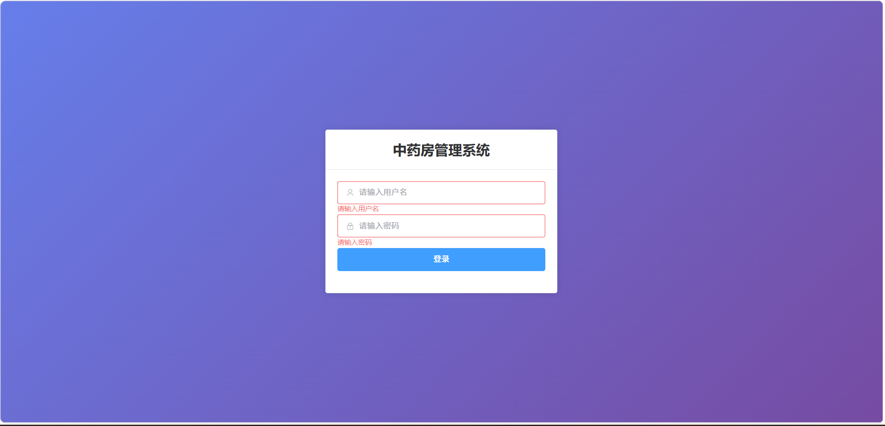
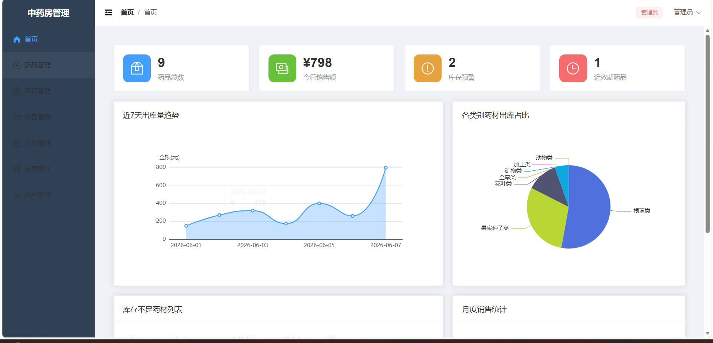
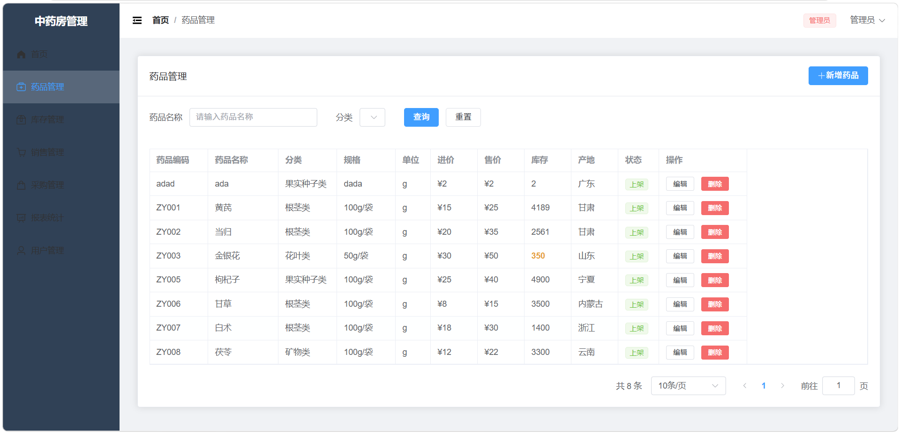
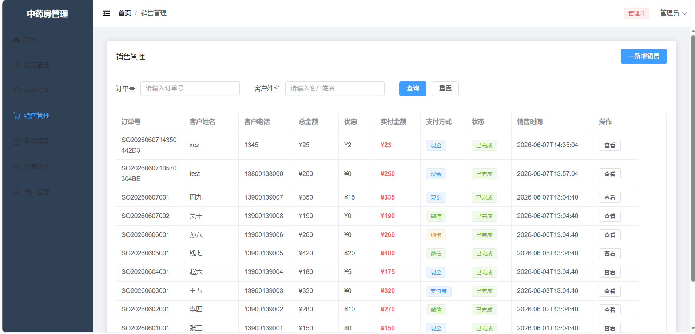
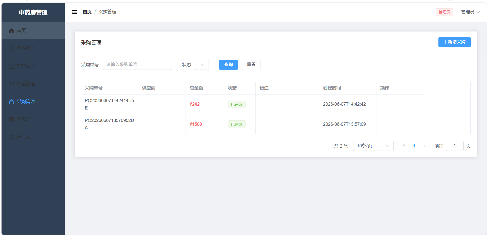
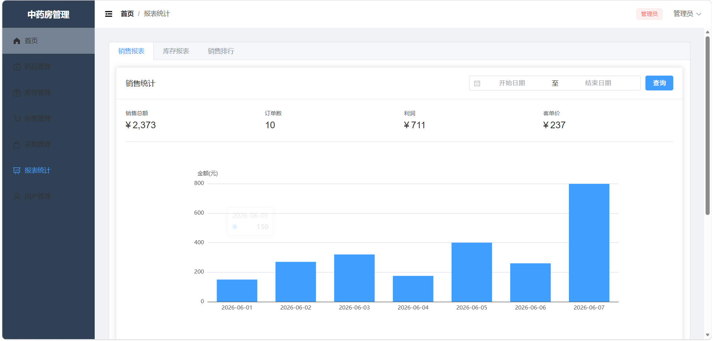
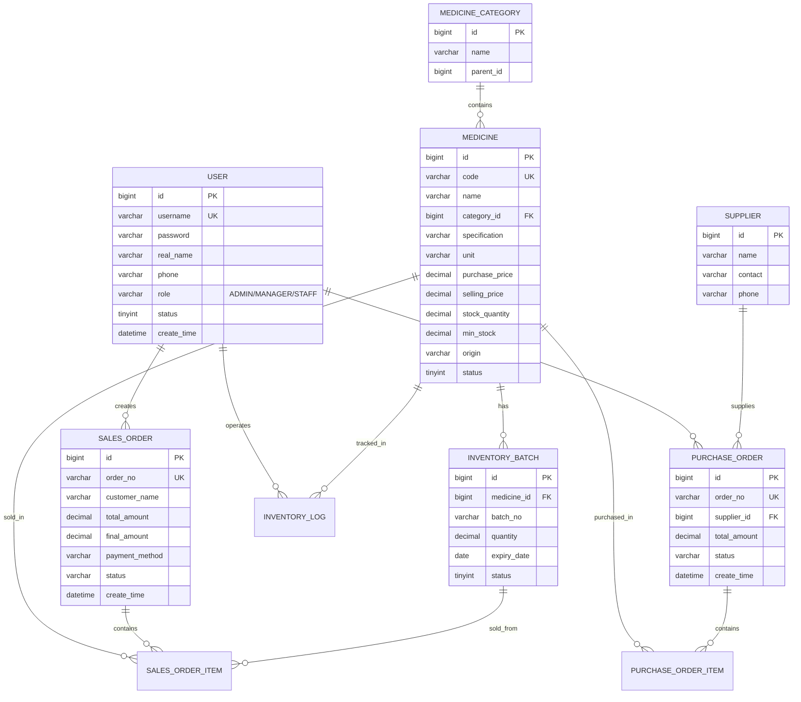

<p align="center">
  <h1 align="center">🏥 中药房库存与销售管理系统</h1>
  <p align="center">基于 Vue 3 + Spring Boot + MySQL 的现代化中药房管理解决方案</p>
  <p align="center">
    
    
    
    
    
  </p>
</p>

---

## 📖 项目简介

本系统是一个专为中药房设计的库存与销售管理系统，旨在帮助中药房实现数字化管理，提高运营效率。系统支持多角色权限管理，包括管理员、经理和员工三种角色，满足不同岗位的工作需求。

### ✨ 核心亮点

- 🎯 **智能库存预警** - 库存低于阈值自动提醒，避免缺货
- 📊 **数据可视化** - ECharts 图表展示销售趋势和库存分析
- 🔐 **多角色权限** - 管理员/经理/员工，精细化权限控制
- 📦 **批次管理** - 支持药品批次追踪，先进先出
- ⏰ **近效期提醒** - 有效期临近30天的药品单独提醒

---

## 📸 项目截图

### 登录页面
<!-- 在此插入登录页面截图 -->
<p align="center">
  
</p>

### 首页看板
<!-- 在此插入首页看板截图 -->
<p align="center">
  
</p>

### 药品管理
<!-- 在此插入药品管理截图 -->
<p align="center">
  
</p>

### 销售管理
<!-- 在此插入销售管理截图 -->
<p align="center">
  
</p>

### 采购管理
<!-- 在此插入采购管理截图 -->
<p align="center">
  
</p>

### 报表统计
<!-- 在此插入报表统计截图 -->
<p align="center">
  
</p>

---

## 🚀 功能特性

### 📋 功能模块

| 模块 | 功能描述 |
|------|----------|
| **首页看板** | 统计卡片、销售趋势图、分类饼图、库存预警列表、月度统计 |
| **药品管理** | 药品增删改查、分类管理、规格管理、库存预警设置 |
| **库存管理** | 库存批次查看、近效期提醒（30天）、库存状态统计 |
| **销售管理** | 新增销售、订单管理、多种支付方式、订单详情查看 |
| **采购管理** | 新增采购、供应商管理、入库管理、批次追踪 |
| **报表统计** | 销售报表（按日期）、库存报表、销售排行（按时间段） |
| **用户管理** | 用户增删改查、重置密码、启用/禁用、角色权限控制 |

### 👥 角色权限

| 功能 | 管理员 | 经理 | 员工 |
|:----:|:------:|:----:|:----:|
| 首页看板 | ✅ | ✅ | ✅ |
| 药品管理 | ✅ | ✅ | ✅ |
| 库存管理 | ✅ | ✅ | ✅ |
| 销售管理 | ✅ | ✅ | ✅ |
| 采购管理 | ✅ | ✅ | ❌ |
| 报表统计 | ✅ | ✅ | ✅ |
| 用户管理 | ✅ | ❌ | ❌ |

---

## 🛠️ 技术栈

### 前端技术

| 技术 | 说明 |
|------|------|
| [Vue 3](https://vuejs.org/) | 渐进式 JavaScript 框架 |
| [Vite](https://vitejs.dev/) | 下一代前端构建工具 |
| [Element Plus](https://element-plus.org/) | Vue 3 UI 组件库 |
| [Pinia](https://pinia.vuejs.org/) | Vue 状态管理库 |
| [Vue Router](https://router.vuejs.org/) | Vue 路由管理 |
| [Axios](https://axios-http.com/) | HTTP 客户端 |
| [ECharts](https://echarts.apache.org/) | 数据可视化图表库 |

### 后端技术

| 技术 | 说明 |
|------|------|
| [Spring Boot 3.2](https://spring.io/projects/spring-boot) | Java 应用框架 |
| [MyBatis-Plus](https://baomidou.com/) | MyBatis 增强工具 |
| [Spring Security](https://spring.io/projects/spring-security) | 安全框架 |
| [JWT](https://jwt.io/) | JSON Web Token 认证 |
| [MySQL 8.0](https://www.mysql.com/) | 关系型数据库 |
| [Lombok](https://projectlombok.org/) | Java 代码简化工具 |

---

## 📊 数据库 ER 图



> 📝 更多数据库详细信息请查看 [docs/er-diagram.md](docs/er-diagram.md)

---

## 🚀 快速开始

### 环境要求

| 环境 | 版本要求 |
|------|----------|
| JDK | 17+ |
| Maven | 3.6+ |
| Node.js | 16+ |
| MySQL | 8.0+ |

### 1. 克隆项目

```bash
git clone https://github.com/lyh560/tcm-pharmacy-system.git
cd tcm-pharmacy-system
```

### 2. 数据库准备

```bash
# 登录 MySQL
mysql -u root -p

# 创建数据库并导入数据
mysql -u root -p < database/schema.sql
```

### 3. 后端启动

```bash
cd backend

# 修改数据库配置（编辑 src/main/resources/application.yml）
# 修改 username 和 password 为你的 MySQL 账号密码

# 安装依赖并启动
mvn clean install
mvn spring-boot:run
```

后端将运行在 http://localhost:8080

### 4. 前端启动

```bash
cd frontend

# 安装依赖
npm install

# 启动开发服务器
npm run dev
```

前端将运行在 http://localhost:5173

### 5. 访问系统

打开浏览器访问 http://localhost:5173

**测试账号：**

| 账号 | 密码 | 角色 | 权限说明 |
|------|------|------|----------|
| admin | 123456 | 管理员 | 拥有所有功能权限 |
| manager | 123456 | 经理 | 可采购，不可管理用户 |
| staff | 123456 | 员工 | 可查看和销售，不可采购和管理用户 |

---

## 📁 项目结构

```
tcm-pharmacy-system/
├── 📄 README.md                    # 项目说明文档
├── 📄 LICENSE                      # MIT 开源协议
├── 📄 .gitignore                   # Git 忽略配置
│
├── 📂 docs/                        # 文档目录
│   └── 📄 er-diagram.md           # 数据库 ER 图详细说明
│
├── 📂 database/                    # 数据库脚本
│   └── 📄 schema.sql              # 建表语句和初始数据
│
├── 📂 backend/                     # Spring Boot 后端
│   ├── 📄 pom.xml                 # Maven 配置
│   └── 📂 src/main/
│       ├── 📂 java/com/tcm/pharmacy/
│       │   ├── 📄 TcmPharmacyApplication.java  # 启动类
│       │   ├── 📂 config/        # 配置类
│       │   ├── 📂 controller/    # 控制器
│       │   ├── 📂 service/       # 业务逻辑
│       │   ├── 📂 mapper/        # 数据访问
│       │   ├── 📂 entity/        # 实体类
│       │   ├── 📂 dto/           # 数据传输对象
│       │   └── 📂 util/          # 工具类
│       └── 📂 resources/
│           └── 📄 application.yml # 应用配置
│
└── 📂 frontend/                    # Vue 3 前端
    ├── 📄 package.json            # npm 配置
    ├── 📄 vite.config.js          # Vite 配置
    └── 📂 src/
        ├── 📄 App.vue             # 根组件
        ├── 📄 main.js             # 入口文件
        ├── 📂 layout/            # 布局组件
        ├── 📂 views/             # 页面组件
        │   ├── 📄 Dashboard.vue  # 首页看板
        │   ├── 📄 Login.vue      # 登录页
        │   ├── 📂 medicine/      # 药品管理
        │   ├── 📂 inventory/     # 库存管理
        │   ├── 📂 sales/         # 销售管理
        │   ├── 📂 purchase/      # 采购管理
        │   ├── 📂 report/        # 报表统计
        │   └── 📂 user/          # 用户管理
        ├── 📂 router/            # 路由配置
        ├── 📂 stores/            # 状态管理
        └── 📂 utils/             # 工具函数
```

---

## 📡 API 接口

### 认证接口

| 方法 | 路径 | 说明 |
|------|------|------|
| POST | `/api/v1/auth/login` | 用户登录 |
| GET | `/api/v1/auth/me` | 获取当前用户信息 |

### 药品管理

| 方法 | 路径 | 说明 |
|------|------|------|
| GET | `/api/v1/medicine/page` | 分页查询药品 |
| GET | `/api/v1/medicine/list` | 获取药品列表 |
| GET | `/api/v1/medicine/{id}` | 获取药品详情 |
| POST | `/api/v1/medicine` | 新增药品 |
| PUT | `/api/v1/medicine` | 更新药品 |
| DELETE | `/api/v1/medicine/{id}` | 删除药品 |

### 销售管理

| 方法 | 路径 | 说明 |
|------|------|------|
| GET | `/api/v1/sales/page` | 分页查询销售单 |
| POST | `/api/v1/sales` | 新增销售单 |
| GET | `/api/v1/sales/{id}` | 获取订单详情 |

### 采购管理

| 方法 | 路径 | 说明 |
|------|------|------|
| GET | `/api/v1/purchase/page` | 分页查询采购单 |
| POST | `/api/v1/purchase` | 新增采购单 |
| POST | `/api/v1/purchase/{id}/complete` | 完成入库 |

### 报表统计

| 方法 | 路径 | 说明 |
|------|------|------|
| GET | `/api/v1/report/sales` | 销售报表（支持日期范围） |
| GET | `/api/v1/report/sales-ranking` | 销售排行（支持时间段） |
| GET | `/api/v1/dashboard/stats` | 统计数据 |
| GET | `/api/v1/dashboard/sales-trend` | 近7天销售趋势 |

---

## 🔧 构建部署

### 前端构建

```bash
cd frontend
npm run build
```

构建产物将输出到 `frontend/dist/` 目录。

### 后端打包

```bash
cd backend
mvn clean package
```

打包后的文件为 `backend/target/pharmacy-1.0.0.jar`。

### 生产环境部署

```bash
# 启动后端
java -jar backend/target/pharmacy-1.0.0.jar

# 前端部署到 Nginx
# 将 frontend/dist/ 目录复制到 Nginx 的 html 目录
```

---

## ❓ 常见问题

### Q: 数据库连接失败？
A: 请检查 `backend/src/main/resources/application.yml` 中的数据库配置，确保 MySQL 服务已启动。

### Q: 前端启动失败？
A: 请确保已安装 Node.js 16+ 版本，并在 `frontend` 目录下执行 `npm install` 安装依赖。

### Q: 登录失败？
A: 请确保数据库已导入初始数据（`database/schema.sql`），默认密码为 `123456`。

### Q: 如何修改端口？
A: 
- 后端端口：修改 `application.yml` 中的 `server.port`
- 前端端口：修改 `vite.config.js` 中的 `server.port`

---

## 📝 更新日志

### v1.0.0 (2026-06-07)

🎉 **初始版本发布**

**新功能：**
- ✅ 药品管理（增删改查、分类管理）
- ✅ 库存管理（批次管理、近效期提醒）
- ✅ 销售管理（新增销售、订单管理）
- ✅ 采购管理（新增采购、入库管理）
- ✅ 报表统计（销售报表、库存报表、销售排行）
- ✅ 用户管理（多角色权限控制）
- ✅ 数据看板（统计卡片、图表展示）

---

## 🤝 贡献指南

欢迎提交 Issue 和 Pull Request！

1. Fork 本仓库
2. 创建你的特性分支 (`git checkout -b feature/AmazingFeature`)
3. 提交你的更改 (`git commit -m 'Add some AmazingFeature'`)
4. 推送到分支 (`git push origin feature/AmazingFeature`)
5. 打开一个 Pull Request

---

## 📄 开源协议

本项目基于 MIT 协议开源 - 详见 [LICENSE](LICENSE) 文件

---

## 👨‍💻 作者

**lyh560**

- GitHub: [@lyh560](https://github.com/lyh560)

---

## 🙏 致谢

感谢以下开源项目：

- [Vue.js](https://vuejs.org/)
- [Spring Boot](https://spring.io/projects/spring-boot)
- [Element Plus](https://element-plus.org/)
- [MyBatis-Plus](https://baomidou.com/)
- [ECharts](https://echarts.apache.org/)

---

<p align="center">
  如果这个项目对你有帮助，请给一个 ⭐️ Star 支持一下！
</p>
